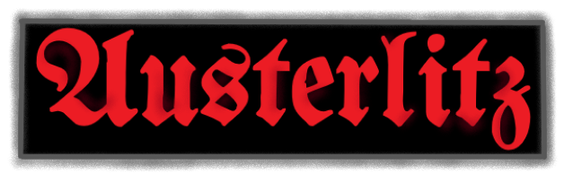

# Austerlitz Chess Engine by Simon B.

## Overview
Austerlitz is a mediocre Polish chess engine written from scratch fully in C++ language for about 6 months, 
since July 2023. For this moment, Austerlitz supports basic UCI commands, including hash table 
manipulation and other debug-purpose commands. Basing on hand-crafted evaluation, min-max search
with alpha-beta pruning framework and other optimization techniques, Austerlitz v1.4.0 got earlier 2000+ ELO rank on 
[lichess](https://lichess.org/@/AusterlitzEngine/all).

***

## Features
Austerlitz finds best move for given position generating min-max search and picking best move based
on HCE - static, hand crafted evaluation routine. 
### Search:
* *Iterative Deepening*
* *Aspiration Windows*
* *Principal Variation Search*
* *Quiscence Search*
* *Global Transposition Table*
	* *Depth-preferred replacement scheme*
	* *Aging, no buckets*
* *Move Ordering*
	* *MVV/LVA + Static Exchange Evaluation*
	* *PV line probing*
	* *Killer Heuristics*
	* *Countermove Heuristics*
	* *Relative History Heuristics*
* *Selectivity*
	* *Draw Detection*
		* *50 Moves Rule*
		* *Repetition Draw*
	* *Pruning*
		* *Null Move Pruning*
		* *Late Move Pruning, as a Move Count Pruning*
		* *Futility Pruning*
		* *Delta Pruning*
		* *Equal and Bad Captures Pruning*
	* *Extensions*
		* *Check Extensions*
		* *Singular Extensions*
	* *Reductions*
		* *Razoring*
		* *Late Move Reduction*

### Hand-Crafted Evaluation:
* *Tapered Eval*
* *Lazy Eval*
* *Piece-Square Tables*
* *Material*
* *King Tropism*
* *Pawn Structure*
	* *Pawn Islands*
	* *Backward Pawns*
	* *Double Pawns*
	* *Passers*
	* *Isolanis*
	* *Overly Advanced Pawns*
* *Knight Position*
	* *Outpos Check*
* *Bishop Position*
	* *Bishop Pair*
* *Rook Position*
	* *Tarrash Rule*
	* *Open File Consideration*
* *Queen Position*
	* *Early development penalty*
* *King Zone Control*
* *Castling Possibility*
* *Mobility + Connectivity*

***

## Austerlitz's name inspiration
The name refers to Napoleon's great victory over the united Austrian and Russian armies at the village of 
Austerlitz in 1805. It's also connected with *"War and Peace"* by great Russian novelist Leo Tolstoy, 
widely describing Napoleon's campaigns in Europe.

***

## Credits
* [BBC Chess Engine Tutorials by Maksim Korzh](https://www.youtube.com/playlist?list=PLmN0neTso3Jxh8ZIylk74JpwfiWNI76Cs)
whose tutorials were an introduction to chess programming world and which helped me projecting
my own engine from scratch.
* [Mediocre Chess Engine Tutorials by Jonatan Pettersson](https://mediocrechess.blogspot.com/) for explaining hard programming
concepts really clearly.
* [ChessProgramming Wiki Team](https://www.chessprogramming.org/Main_Page) 
for the entire knowledge concentrated in one place.

### License
Austerlitz is licensed under the MIT License.